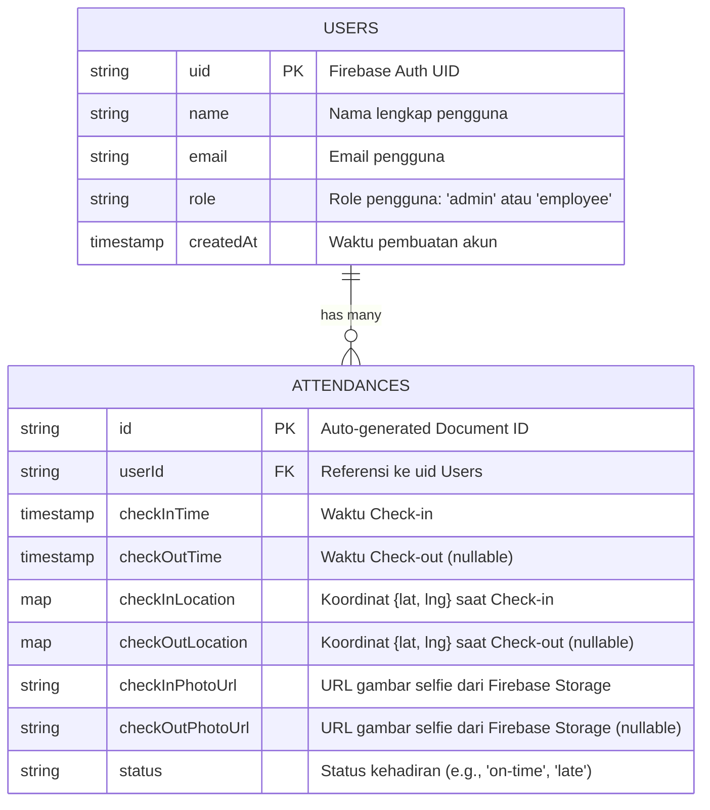

# Factory Attendance - Technical Documentation

## 1. System Architecture

### High-Level Architecture
Aplikasi Factory Attendance dibangun dengan memisahkan sisi Client (Mobile App) dan Serverless Backend (Firebase).
- **Frontend (Flutter)**: Bertanggung jawab atas UI/UX, memvalidasi input secara lokal, mengambil gambar menggunakan kamera perangkat, dan mendapatkan lokasi GPS pengguna.
- **Backend / BaaS (Firebase)**: 
  - **Firebase Authentication**: Digunakan untuk autentikasi dan manajemen sesi pengguna (Admin & Employee).
  - **Cloud Firestore**: Berperan sebagai database NoSQL utama untuk menyimpan data pengguna dan riwayat absensi.
  - **Firebase Storage**: Menyimpan aset statis, khususnya foto selfie yang diambil saat absensi.

### Clean Architecture
Aplikasi ini menerapkan Clean Architecture yang membagi kode ke dalam 4 layer utama:
- **Core**: Berisi komponen fundamental, utilitas, konstanta, dan konfigurasi yang digunakan di seluruh aplikasi.
- **Domain**: Menyimpan *business logic* inti (Entities) dan kontrak atau abstraksi (Repositories). Layer ini independen dan tidak bergantung pada framework atau library eksternal.
- **Data**: Bertanggung jawab atas implementasi dari interface di layer Domain. Layer ini berinteraksi langsung dengan Firebase (Firebase Authentication, Firestore, Storage) melalui *Remote Data Sources*. Model pada layer ini akan melakukan *mapping* data dari JSON/Firestore ke Entities.
- **Presentation**: Layer terluar yang mencakup UI (Widgets/Pages) dan State Management (Provider). Layer ini memanggil *Use Cases* atau *Repositories* dari layer Domain untuk mendapatkan data dan memicu *state rebuild* saat data berubah.

### Architecture Diagram

```mermaid
graph TD
    subgraph Presentation Layer
        UI[Flutter UI / Widgets]
        State[Provider / State Management]
    end

    subgraph Domain Layer
        Usecase[Use Cases]
        Entity[Entities]
        RepoInterface[Repository Interfaces]
    end

    subgraph Data Layer
        RepoImpl[Repository Implementation]
        Model[Models]
        subgraph Remote Data Source
            FBAuth[Firebase Auth]
            Firestore[Cloud Firestore]
            FBStorage[Firebase Storage]
        end
    end

    UI -->|Triggers events| State
    State -->|Calls| Usecase
    Usecase -->|Depends on| RepoInterface
    Usecase -->|Uses| Entity
    RepoImpl -.->|Implements| RepoInterface
    RepoImpl -->|Maps to/from| Model
    RepoImpl -->|Interacts with| Remote Data Source
```

## 2. Entity-Relationship (ER) Diagram / Data Modeling

Meskipun menggunakan database NoSQL (Cloud Firestore), struktur relasional entitas utama dapat dipetakan sebagai berikut:



### Penjelasan Skema
1. **Users Collection**: Menyimpan profil pengguna. Field `role` sangat penting untuk membedakan hak akses dan otorisasi. Admin akan diarahkan ke Dashboard Admin (KPI, Map, Export CSV), sedangkan Employee akan diarahkan ke layar Absensi.
2. **Attendances Collection**: Menyimpan riwayat absen.
   - `userId`: Menghubungkan log absen dengan karyawan tertentu.
   - `checkInLocation` & `checkOutLocation`: Menyimpan titik koordinat (latitude & longitude) yang akan digunakan untuk memvalidasi radius Geofencing.
   - `checkInPhotoUrl` & `checkOutPhotoUrl`: Menyimpan *link* gambar dari Firebase Storage sebagai bukti kehadiran.
   - `checkOutTime`: Dapat bernilai *null* jika karyawan belum melakukan check-out pada hari tersebut.

## 3. API & Service Documentation

Karena aplikasi bersifat *serverless*, fungsi repository dan service di bawah ini bertindak sebagai API internal aplikasi untuk berinteraksi dengan Firebase.

### Auth Service

| Nama Fungsi / Service | Deskripsi | Parameter Input | Return / Output |
| --- | --- | --- | --- |
| `loginUser` | Melakukan autentikasi pengguna menggunakan email dan password. | `email` (String), `password` (String) | `UserEntity` (Berisi UID, nama, dan role) |
| `logoutUser` | Menghapus sesi pengguna dari perangkat lokal. | - | `void` |
| `resetPassword` | Mengirimkan email tautan untuk mengatur ulang kata sandi. | `email` (String) | `void` |
| `getCurrentUser` | Mengambil data pengguna yang saat ini sedang login. | - | `UserEntity` (atau null jika tidak ada sesi aktif) |

### Attendance Service

| Nama Fungsi / Service | Deskripsi | Parameter Input | Return / Output |
| --- | --- | --- | --- |
| `submitCheckIn` | Merekam data check-in karyawan termasuk lokasi dan foto selfie. | `userId` (String), `location` (GeoPoint), `photoFile` (File) | `AttendanceEntity` |
| `submitCheckOut` | Memperbarui dokumen absensi harian dengan data check-out. | `attendanceId` (String), `location` (GeoPoint), `photoFile` (File) | `AttendanceEntity` |
| `getHistory` | Mengambil riwayat absensi karyawan tertentu (untuk Employee Dashboard). | `userId` (String), `startDate` (DateTime), `endDate` (DateTime) | `List<AttendanceEntity>` |
| `getAdminKPI` | Mengambil agregasi data kehadiran harian/mingguan (untuk Admin Dashboard). | `dateRange` (DateTimeRange) | `KPIDataEntity` (Berisi statistik kehadiran, keterlambatan) |
| `exportToCSV` | Menghasilkan file CSV dari data riwayat absensi. | `startDate` (DateTime), `endDate` (DateTime) | `File` (File CSV yang siap diunduh/dibagikan) |
| `getAllAttendances` | Mengambil seluruh titik lokasi absen untuk dipetakan (Admin Map). | `date` (DateTime) | `List<AttendanceEntity>` |
